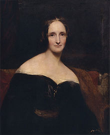

**Bundled image below:**

Mary Wollstonecraft Shelley was an English novelist, short story writer, dramatist, essayist, biographer, and travel writer, best known for her Gothic novel Frankenstein: or, The Modern Prometheus.